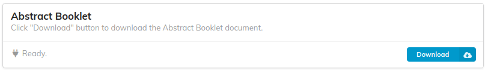
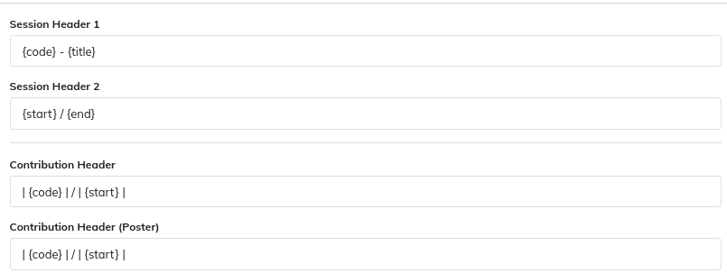
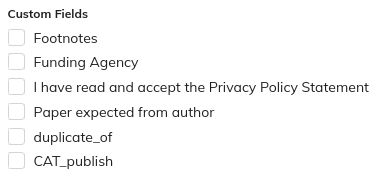

## Download functionality

By clicking on the Download button, the plugin is starting a task in MEOW that is producing as an output an ODT file of the Abstract Booklet.

## Settings

The abstract booklet generation settings are about the format of the headers and the custom fields to be included.

### Headers

It is possible to customize the format for the following headers: 

- Session Header 1, which is the main header

- Session Header 2, which is the subheader

- Contribution Header, which is the header for normal contributions

- Contribution Header (Poster), which is the header for those contributions marked as posters

Specific placeholders have to be used, such as:

- {code} for the Session/Contribution code

- {title} for the Session/Contribution title

- {start} for the Session/Contribution start date

- {end} for the Session/Contribution end date

- | (pipe) for Table columns, as the contribution header is formatted as a table

### Custom fields

By checking any of the listed custom fields, they will appear in the contribution. Custom fields are fields defined in the "Contributions" panel of Indico (under Organization), therefore they can change based on the conference configuration.

