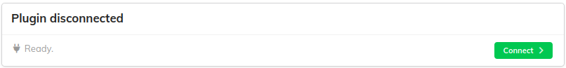
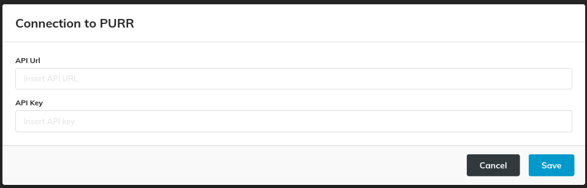

When PURR is not connected to any MEOW instance, it is displayed as "disconnected" like in the following picture.

By clicking on the "Connect" button, a modal is opened.

- API Url is the URL of a server that hosts an instance of MEOW.

- API Key is an alphanumeric string that needs to be provided in order to successfully connect to the desired MEOW instance.