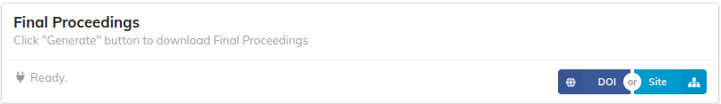

## Site functionality

By clicking on the "Site" button, a Modal with more functionalities is opened.

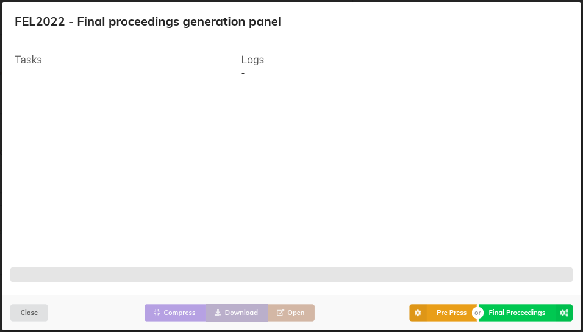

### Pre-Press and Final Proceedings

Both the 'Pre-Press' and 'Final Proceedings' buttons are related to the generation of the conference's proceedings, with some slight differences.

In fact, 'Pre-Press' involves:

- Including contributions that have been accepted (green state) but have not undergone QA.
- Excluding contribution slides, if any.
- Performing a PDF check that will log warnings without halting the task execution.
- Skipping the generation of DOI payloads.
- The link to each contribution's DOI page is internal and not on [DOI.org](https://doi.org).
- The link to each PDF paper in the contribution details and in the at-a-glance proceedings volume is relative (internal with respect to the generated site).

On the other hand, 'Final Proceedings' involves:

- Including ONLY contributions that have been accepted (green state) and have undergone QA.
- Including contribution slides when available.
- Performing a PDF check that will log errors on the panel without halting the task execution.
- Generating JSON payloads for each contribution's DOI.
- The link to each contribution's DOI page is on [DOI.org](https://doi.org).
- The link to each PDF paper in the contribution details and in the at-a-glance proceedings volume is absolute.

The main goal of 'Pre-Press' is to perform a quicker run, while 'Final Proceedings' is intended for the generation of the proceedings to be published.

Below is an example of a run.

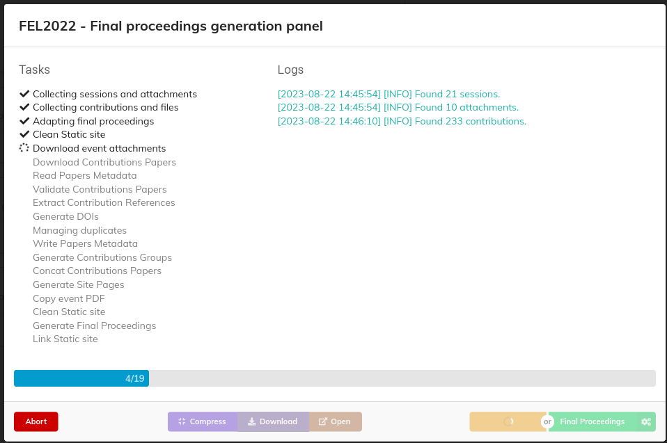

All the tasks are listed on the left, highlighting those completed, running, and scheduled.
On the right, there are logs containing informative messages on the current run.
At the bottom, a progress bar shows the progress status.
If the run is successful, the panel will appear as shown in the following picture:

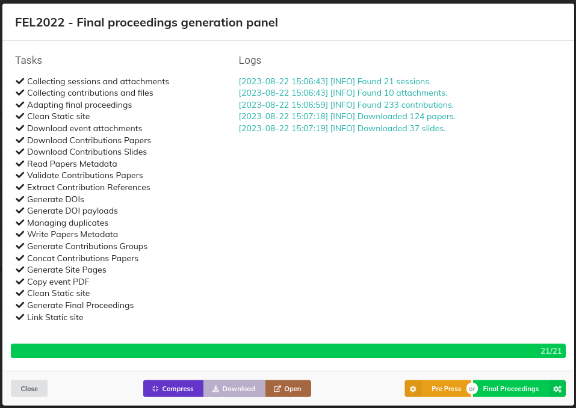

If any blocking error occurs during the run, a message is displayed to the user, as shown in the following example:

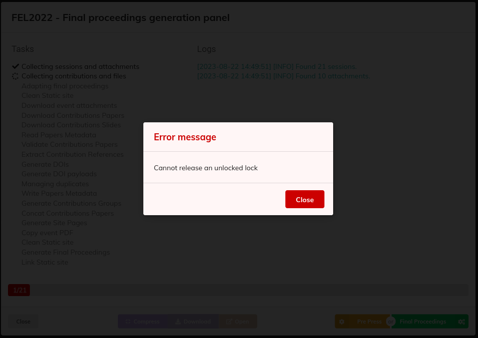

### Compress

The "Compress" button is enabled only if any proceedings generation run has been completed successfully. This task compresses the generated proceeding folder to make them available for download.

### Download

The "Download" button is enabled only once the compressed proceedings are available. This functionality initiates the download in the web browser.

### Open

The "Open" button is enabled only if any proceedings generation run has been completed successfully. By clicking on it, a preview of the proceedings website is opened.

## DOI Functionality

The "DOI" button is enabled only if the DOI payload files have been generated previously. At the start, a task that fetches the status of the contributions' DOIs is launched automatically in MEOW.

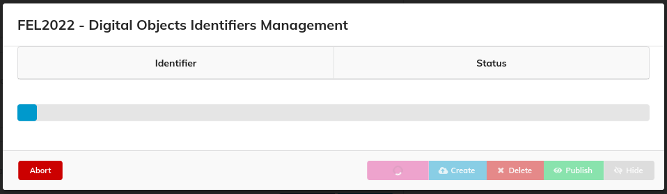

As a result, the status of every DOI is listed:

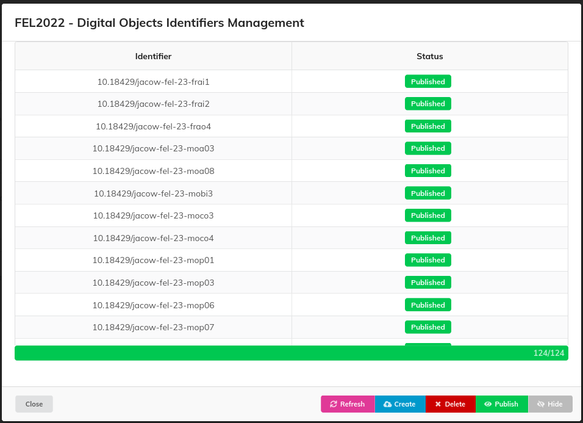

Following is the list of available actions:

- **Refresh**: fetches the status of the DOIs again.
- **Create**: updates the status of the DOIs to "draft" (this action doesn't work if DOIs have already been published or registered).
- **Delete**: deletes the DOIs from the datacite repository (this action doesn't work if DOIs have already been published or registered).
- **Publish**: updates the status of the DOIs to "findable."
- **Hide**: updates the status of the DOIs to "hidden" (this action changes the DOIs to "registered" if they have already been published once).

## Settings

Settings for final proceedings are organized into several subsections.

### General

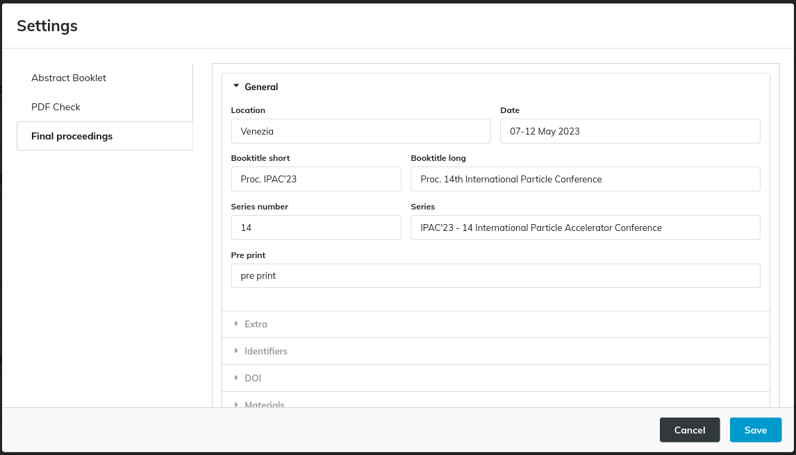on about the conference, such as location, dates, long and short book titles, series, and series numbers. It also includes the "pre-print" label.

This section comprises the following fields:

- **Location**: For example, "Venice," serves as a label indicating where the conference took place. This string is utilised as a field when constructing a contribution's DOI and references.

- **Date**: For instance, "07-12 May 2023," acts as a label specifying the dates when the conference occurred. This information is prominently displayed on the site's homepage to convey the conference schedule.

- **Booktitle short**: An abbreviated label like "IPAC'23" is used in the header of website pages and within metadata for references and DOIs.

- **Booktitle long**: A longer label such as "14th International Particle Conference" is employed on the homepage and in metadata for references and DOIs to provide a more descriptive title.

- **Series**: This field, for instance, "IPAC'23 - 14 International Particle Accelerator Conference," is utilised within metadata for references and DOIs to denote the conference series.

- **Series number**: For example, "14," indicates the conference's position in the series.

- **Preprint**: This label is affixed to the PDF of any contribution accepted through the "peer review" module of Indico. Example of such an overprint follows:
  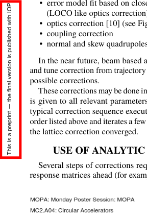

### Extra

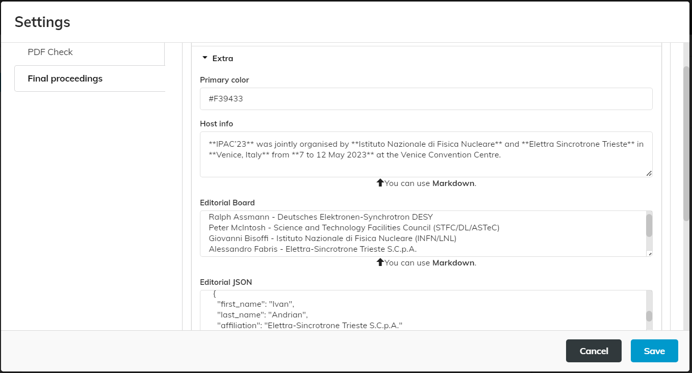

This section encompasses the following configuration options:

- **Primary color**: This option allows you to define the website's theme color.

- **Host info**: Text added to the homepage, under the volumes section (as highlighted in the picture below). Markdown can be utilised to customise the text's appearance.

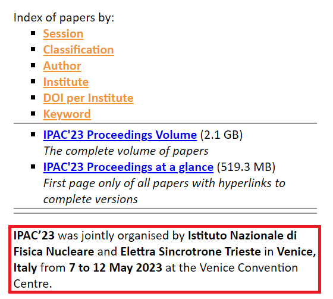

- **Editorial Board**: This section appears in the page footer and in all paper detail pages referenced by doi.org. While Markdown can be employed to customise its appearance, we are discouraging its use since it won't be interpreted in the paper detail pages.

- **Editorial JSON**: This setting defines the list of editors who contributed to the conference. It is represented as a JSON array of objects in the format: `{first_name, last_name, affiliation}`. This information is used to populate the "editors" field in the DOI metadata. E.g.:
  
  ```
  [
    {
      "first_name": "OC",
      "last_name": "Chair",
      "affiliation": "JACoW"
    },
    {
      "first_name": "SPC",
      "last_name": "Chair",
      "affiliation": "JACoW"
    }
  ]
  ```

- **Custom field for contribution duplicates**: This option allows you to specify the actual name of the `CAT_duplicate_of` field. `CAT_duplicate_of` is a custom field in Indico that can be used to indicate that one contribution has a "parent" contribution, sharing information such as references and DOIs with it. Here follows an example where contribution `SUPM014` has a custom field `CAT_duplicate_of` equal to `THPL082`:
  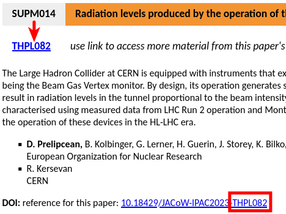

- **Custom field for contributions not to publish**: This option allows you to specify the actual name of the `CAT_publish` field. `CAT_publish` is a custom field in Indico that can be used to control whether a contribution can be published or not, based on the value of this field (if `false` that contribution won't appear in the proceedings). It is sufficient to be set as a boolean custom field with only the "False" value.

### Identifiers

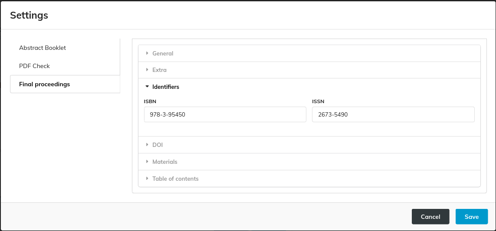

This section is used to define the **ISBN** and **ISSN** of the conference.

### DOI

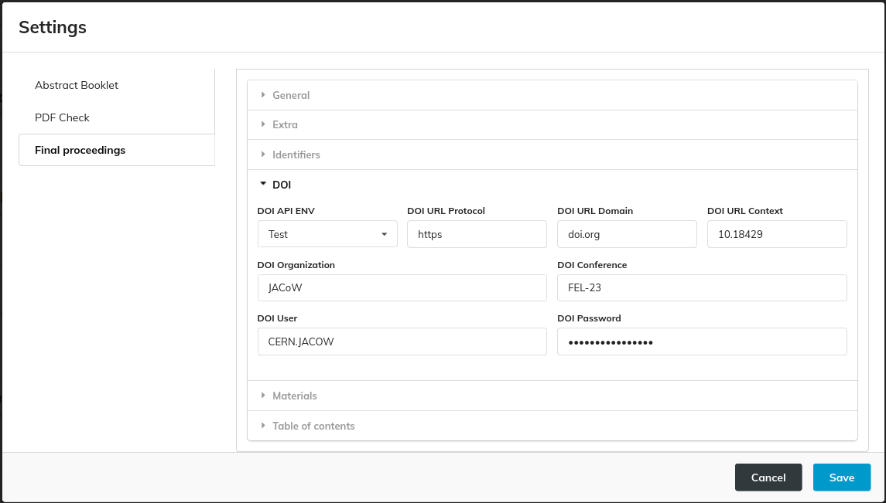

This section includes settings for DOI:

- **DOI API ENV**: Used to switch between *Test* and *Production*.

The following picture describes how some of these settings are used to compose the DOI URL:

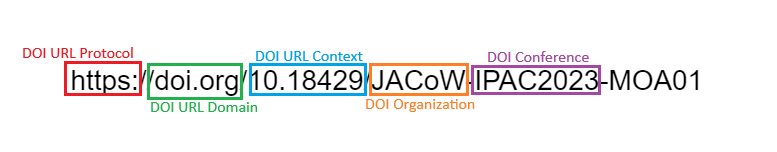

Finally, **DOI User** and **DOI Password** are the credentials to access datacite.org's APIs.

### Materials

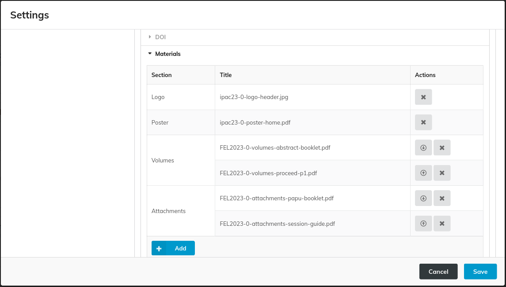

This section manages various assets related to the proceedings, such as logos, posters, covers of the at-a-glance volume, covers of the final proceedings volume, other volumes, and custom attachments. It is organised as a grouped table. For *volumes* and *attachments*, you can sort the files to have them listed in the desired order on the proceedings website.

The files are sourced from the event's materials in Indico. To add a material to the proceedings, simply click on the 'Add' button. This will open a new modal where you can select the desired material and section, as illustrated in the following image.

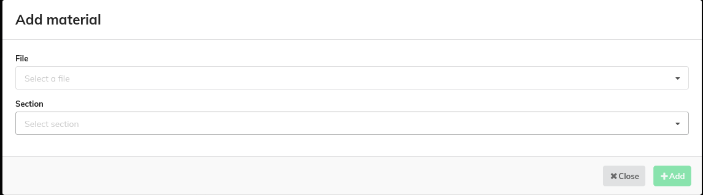

### Table of Contents

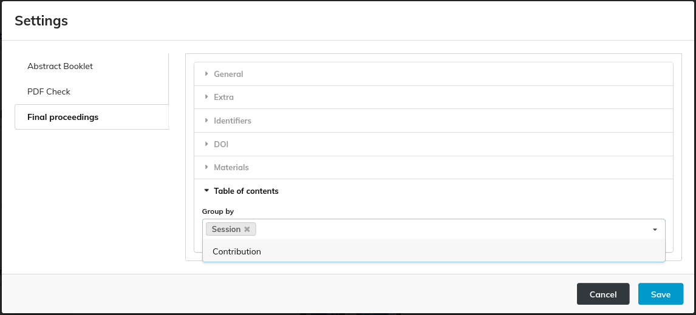

This section covers the table of contents in the proceedings volume. You can include both sessions and contributions, or choose to include only one of them. It is recommended to include only sessions for conferences with a large number of contributions. This helps to keep the table of contents concise.

Example of a Table of Contents created with both Sessions and Contributions:

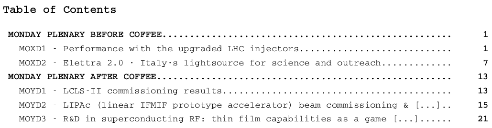

## Visual example of settings' result

The following picture shows the home page of a proceedings package with the values of the settings highlighted and explained.

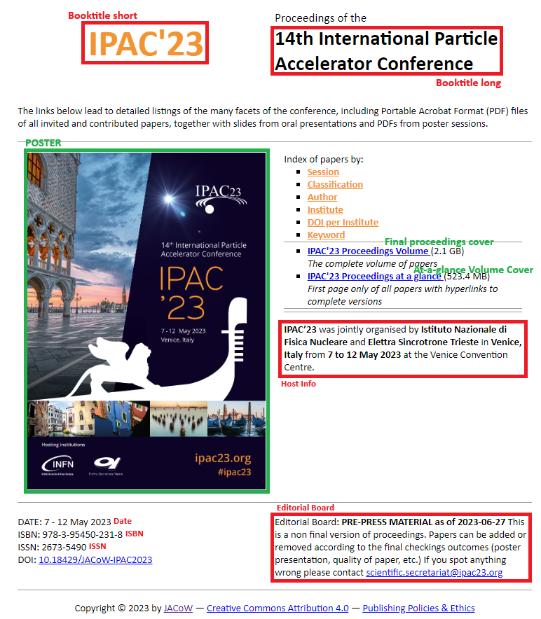
