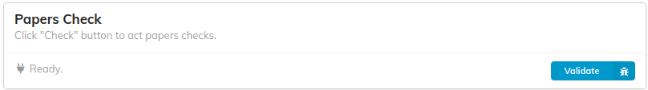
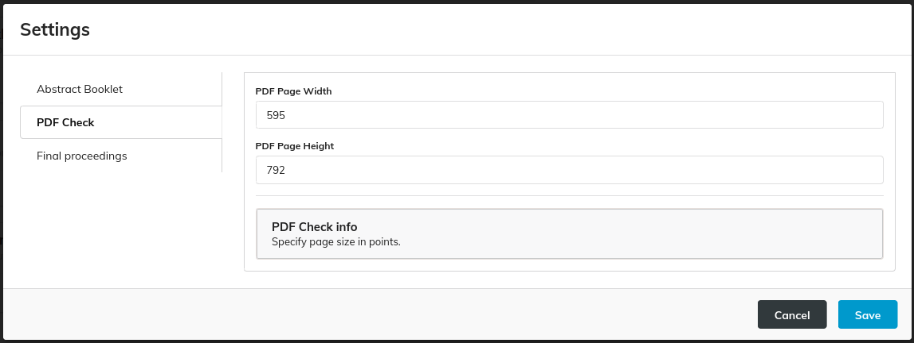

## Validate functionality

By clicking on the "Validate" button, the plugin is starting a task in MEOW that is performing a set of checks on the papers' PDF files. The result of the task is being displayed in a modal that lists the PDF files that need to be checked, or none if no error occurs.

## Settings

The Papers Check settings are about the size of the papers' pages. 
