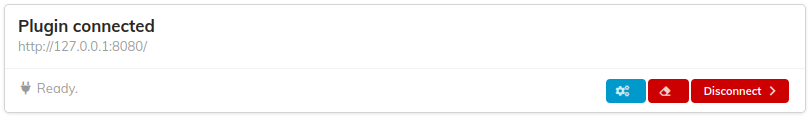
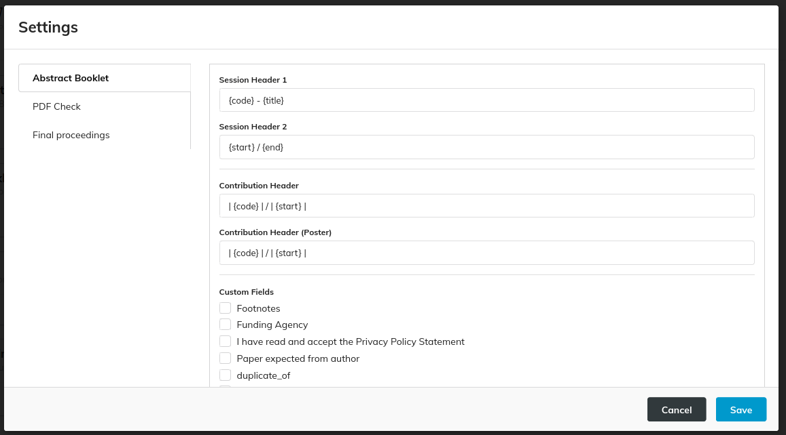
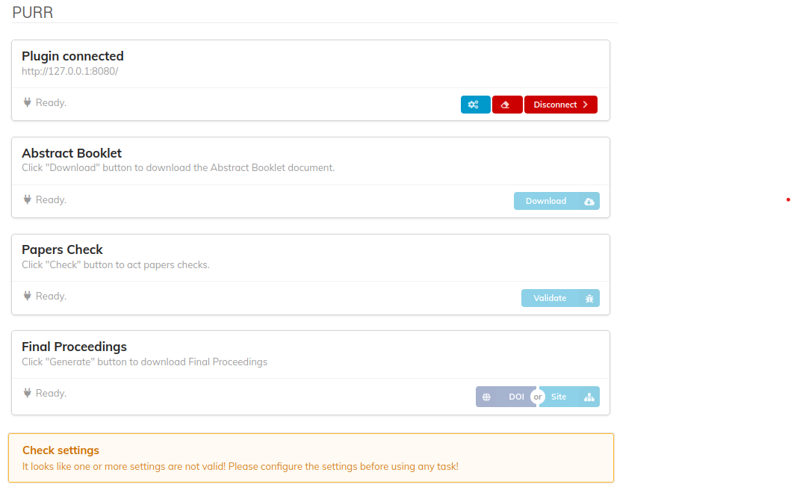

When PURR successfully connects to a MEOW remote instance, it is displayed as "connected," as shown in the following picture:

There will be three available buttons:

- Manage Settings
- Clear MEOW Folders
- Disconnect

### Manage Settings

This functionality covers settings management. Clicking on it opens a modal with an accordion containing three sections:

  - [Abstract Booklet](abstractBooklet.md)
  - [PDF Check](papersCheck.md)
  - [Final Proceedings](finalProceedings.md)

Each section covers the specific settings of each main functionality. To learn more about the settings, visit the dedicated page for each functionality. If the settings are incomplete, as in the first time a user connects to a MEOW instance, they will be marked as "incomplete." In this case, a warning message is displayed at the bottom of the view, and the functionalities are not accessible.

To save the settings, click the "Save" button. If all the required settings are provided, the modal will be closed; otherwise, an error message is displayed.

### Clear MEOW Folders

This functionality deletes all the conference's folders in the MEOW instance. A confirmation prompt is shown before continuing. Perform this task only if strictly necessary, as it will remove the folders for every user working on this conference's final proceedings.

### Disconnect

This functionality disconnects PURR from MEOW. As a result, all user settings will also be deleted, and the plugin will appear as described in [Connection to MEOW](connection.md).
